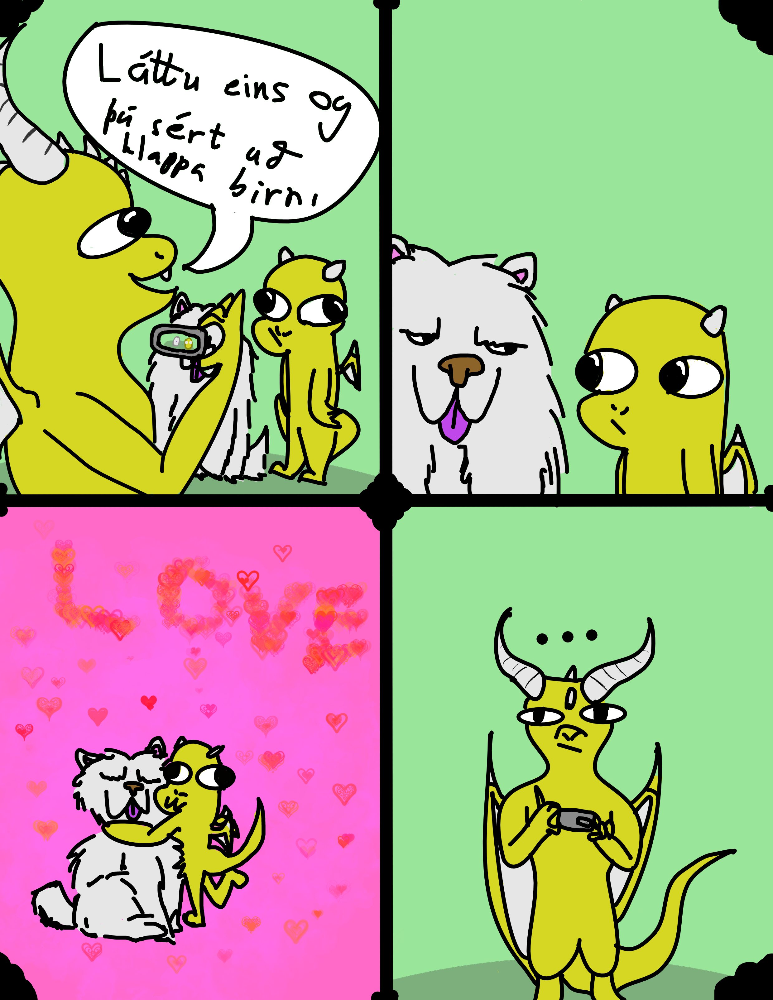

## Teiknimyndasögur Járngerðar

Hér mun Járngerður birta teikningar og teiknimyndasögur.

### Drekagrín (Teiknimyndasaga)

Smelltu hér til að lesa Drekagrín

 

### Stakar myndir
#### Tré

Þessa mynd teiknaði hún í myndmennt í skólanum og eyddi löngum tíma í að gera uppköst og draga í. Eins og sjá má er árangurinn eftir því.

#### Dreki

Járngerður fékk bók með kennslu í að teikna ýmiskonar dreka í afmælisgjöf. Þetta er önnur tveggja mynda sem hún hefur gert með þeirri kunnáttu.

#### Dreki 2

Járngerður fékk bók með kennslu í að teikna ýmiskonar dreka í afmælisgjöf. Þetta er önnur tveggja mynda sem hún hefur gert með þeirri kunnáttu.

#### Rauður dreki

Ég var að leika mér með nýja liti frá Berlín (auðvitað líka með hinum) og fannst myndin vera svo flott að hún ætti að vera á vefsíðunni.

#### Gumskallar

Önnur mynd sem ég teiknaði í skólanum. Þetta er blekmynd sem ég átti að sjá karaktera út úr og mér fannst mér ganga mjög vel.

